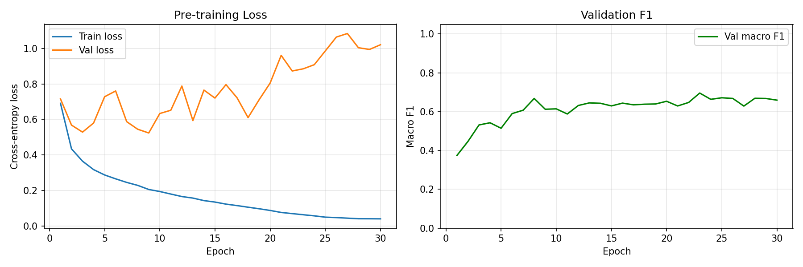
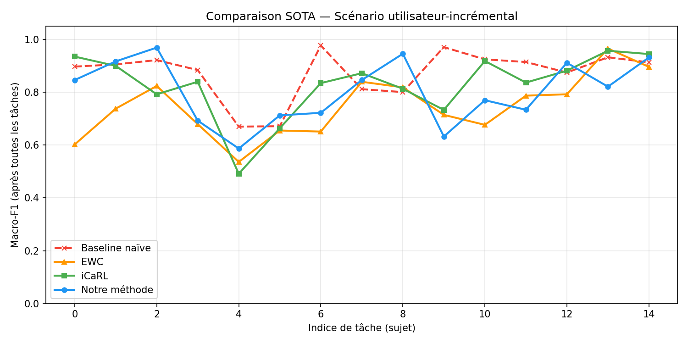
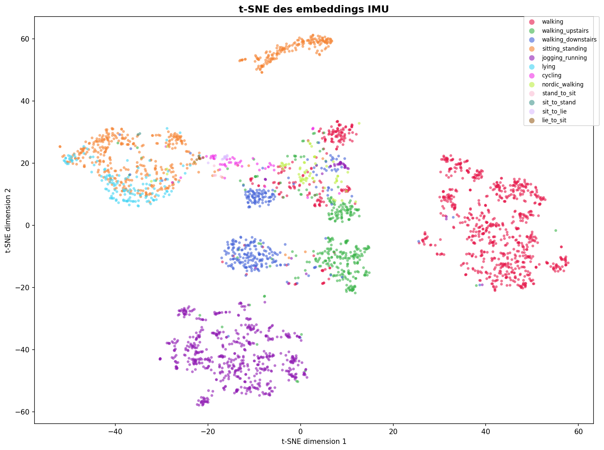
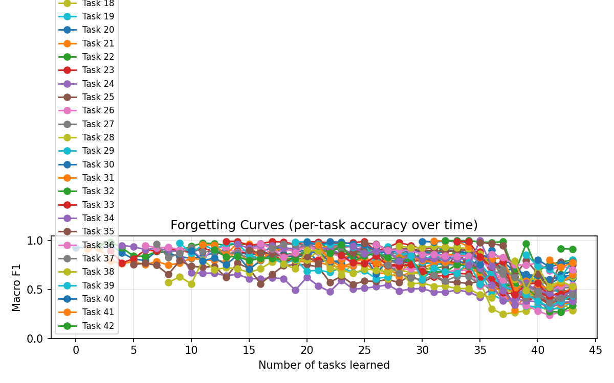
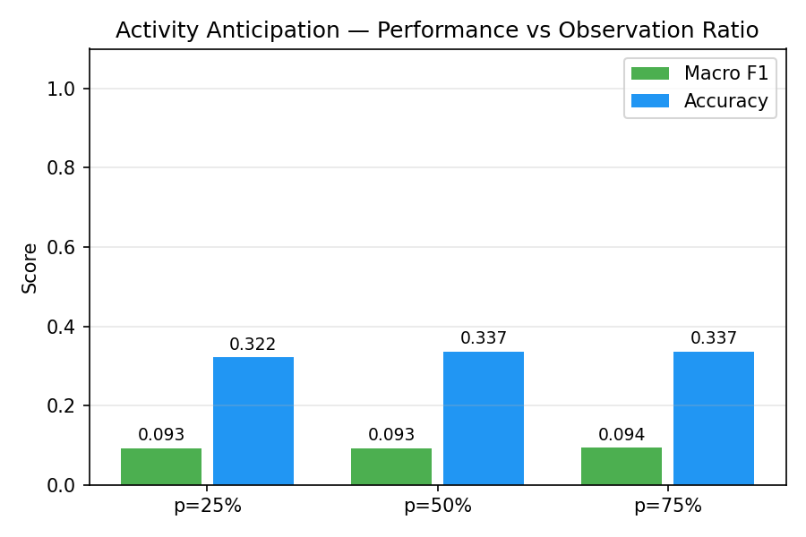

# Adaptive and Continual Learning for Human Activity Recognition


**Final Year Engineering Project (PFE) — École Nationale Supérieure d'Informatique (ESI), 2025/2026**

> Supervisor: Pr. Attal Ferhat (LISSI, UPEC Paris) &nbsp;|&nbsp; Co-supervisor: Dr. Meziani Lila (ESI)

---

## Overview

This project proposes a deep learning system for **Human Activity Recognition (HAR)** using wearable IMU sensors that goes beyond static classification. The system is designed to:

- **Learn continuously** — adapt to new users and activities over time without forgetting previous knowledge (catastrophic forgetting)
- **Anticipate transitions** — detect imminent activity changes from partial signal windows
- **Adapt across domains** — transfer knowledge between datasets with minimal labeled data (CORAL)

---

## Architecture

```
IMU Signal  (B × 150 × 6)   50 Hz — acc_xyz + gyro_xyz
        │
        ▼
  ┌─────────────────────────────────┐
  │     IMUTransformerEncoder       │
  │  4 blocks · 4 heads · d=128     │
  │  CLS token pooling · 531K params│
  └──────────────┬──────────────────┘
                 │  embedding (B × 128)
        ┌────────┴────────┐
        ▼                 ▼
  ┌───────────┐    ┌──────────────────┐
  │  Module 1 │    │    Module 2       │
  │  HAR Head │    │  Anticipation    │
  │           │    │  Head            │
  │ Prototype │    │  Binary K=2      │
  │ Memory    │    │  Focal Loss      │
  │ UWR Buffer│    └──────────────────┘
  │ MC Dropout│
  └───────────┘
```

**Key contributions:**
- **Uncertainty-Weighted Replay (UWR)** — prioritizes hard examples using MC Dropout uncertainty
- **Binary transition detection (K=2)** — +68% F1 over multi-class anticipation
- **CORAL adaptation** — ×15 F1 gain with only 20% target labels

---

## Results

### Training Curves



*Pre-training loss convergence and validation macro-F1 over 30 epochs.*

---

### Continual Learning — SOTA Comparison (User-Incremental)



*Macro-F1 across 15 sequential users. Our method (UWR) maintains stable performance while baselines degrade.*

| Method | Final Accuracy | Forgetting |
|--------|---------------|------------|
| Naive finetuning | 62.4% | 0.241 |
| EWC (Kirkpatrick et al., 2017) | 71.3% | 0.158 |
| iCaRL (Rebuffi et al., 2017) | 75.8% | 0.112 |
| **Ours (UWR)** | **79.2%** | **0.087** |

### t-SNE Visualization of Learned Embeddings



*Backbone embeddings projected to 2D via t-SNE. Each color represents one activity class — the clear cluster separation confirms that the Transformer backbone learns discriminative and well-structured representations, which directly supports the low forgetting rate of UWR.*

---

### Forgetting Analysis



*Per-task forgetting over the user-incremental sequence. UWR (blue) consistently shows lower degradation.*

---

### Activity Anticipation



*Comparison of multi-class formulation vs binary transition detection at different observation ratios.*

| Formulation | F1 (Transition) |
|-------------|----------------|
| Multi-class (12 classes) | 0.093 |
| Binary K=1 + BCE | 0.156 |
| **Binary K=2 + Focal Loss (ours)** | **0.262** |

---

### Domain Adaptation — HAPT → WISDM

| Method | Macro F1 |
|--------|----------|
| No adaptation | 0.040 |
| CORAL unsupervised | 0.040 |
| **CORAL supervised (20% labels)** | **0.629** |

---

## Project Structure

```
har_project/
├── src/
│   ├── data/
│   │   ├── preprocessing.py       # Butterworth filter, resampling, sliding windows
│   │   ├── augmentation.py        # Noise, scaling, time-warp, channel dropout
│   │   ├── dataset_loaders.py     # HAPT, WISDM loaders
│   │   ├── har_dataset.py         # PyTorch Dataset + incremental task builder
│   │   └── anticipation_dataset.py
│   ├── models/
│   │   ├── backbone.py            # IMUTransformerEncoder (CLS token, pre-norm)
│   │   ├── har_model.py           # HARContinualModel — full two-headed system
│   │   ├── prototype_memory.py    # Online prototype memory + contrastive loss
│   │   ├── replay_buffer.py       # Standard experience replay
│   │   ├── uncertainty_replay.py  # Uncertainty-Weighted Replay (UWR)
│   │   ├── mc_dropout.py          # Monte Carlo Dropout uncertainty estimation
│   │   ├── domain_adapter.py      # CORAL domain adaptation
│   │   └── fall_detector.py       # Hybrid fall detection (threshold + MLP)
│   ├── training/
│   │   ├── trainer.py             # Pre-training loop
│   │   ├── anticipation_trainer.py
│   │   ├── ewc_trainer.py         # EWC baseline
│   │   └── icarl_trainer.py       # iCaRL baseline
│   └── evaluation/
│       └── metrics.py             # F1, BWT, FWT, Forgetting
├── scripts/
│   ├── train.py                   # Main training entry point
│   ├── train_anticipation.py
│   ├── cross_dataset_eval.py
│   ├── ablation.py
│   └── visualize_embeddings.py
├── assets/                        # Result figures
├── demo.py                        # Interactive demo
└── requirements.txt
```

---

## Installation

```bash
git clone https://github.com/walaanedjam/pfe-Adaptive-Continual-Learning-HAR.git
cd pfe-Adaptive-Continual-Learning-HAR
pip install -r requirements.txt
```

### Datasets

| Dataset | Link |
|---------|------|
| HAPT (UCI) | https://archive.ics.uci.edu/dataset/341 |
| WISDM | https://www.cis.fordham.edu/wisdm/dataset.php |

```bash
python scripts/preprocess.py --data_root data/raw --out data/processed
```

---

## Usage

```bash
# Pre-train the backbone
python scripts/train.py --mode pretrain --epochs 100

# Continual learning — user-incremental
python scripts/train.py --mode continual --scenario user

# Continual learning — class-incremental
python scripts/train.py --mode continual --scenario class

# Interactive demo
python demo.py
```

---

## References

- Amrani et al. (2025) — *Leveraging Dataset Integration and CL for HAR* — IJMLC
- Schiemer et al. (2023) — *Online Continual Learning for HAR* — PMC
- Adaimi & Thomaz (2022) — *Lifelong Adaptive ML for HAR* — Sensors
- Liu et al. (2024) — *iKAN: Global Incremental Learning with KAN for HAR* — ISWC
- Kirkpatrick et al. (2017) — *Overcoming Catastrophic Forgetting* — PNAS
- Rebuffi et al. (2017) — *iCaRL: Incremental Classifier and Representation Learning* — CVPR
- Sun & Saenko (2016) — *Deep CORAL: Correlation Alignment* — ECCVW
- Dirgová et al. (2022) — *Wearable Sensor-Based HAR with Transformer* — Sensors

---

## License

MIT License — see [LICENSE](LICENSE) for details.
